# WEB STACK IMPLEMENTATION (LAMP STACK) IN AWS #

## WHAT IS TECHNOLOGY STACK ##
A technology stack (or tech stack) refers to the combination of tools, frameworks, programming languages, 
libraries, and services used to build and run a software application.

There are different web technology stacks, namely:
1. LAMP - {Linux, Apache, MySQL, PHP or Python or Perl}
2. LEMP - {Linux, Nginx, MySQL, PHP or Python or Perl}
3. MEAN - {MongoDB, ExpressJS, ReactJS, NodeJS}
4. MERN - {MongoDB, ExpressJS, AngularJS, NodeJS}

## What is the LAMP Stack? ##
The LAMP stack is a popular collection of open-source software used to build and run dynamic websites and web applications. It's one of the most widely used backend setups in the web development world, especially for hosting applications on servers.

Each letter in LAMP represents a layer in the stack:

L – Linux

This is the operating system that acts as the base for the entire stack.
- It manages hardware resources and system processes.
- Linux is free, secure, and widely used in server environments.

A – Apache

Apache is the web server software that delivers web content to users.
- It receives requests (like when you open a website) and sends back the correct web pages.
- Apache is reliable and customizable, making it ideal for handling traffic on websites.

M – MySQL

MySQL is a relational database system used to store and manage data.
- It organizes data in tables and allows websites to retrieve or update information as needed.
- For example, user profiles, login details, or product listings can all be stored in a MySQL database.

P – PHP or Perl or Python)

This is the programming language used to write the logic of your web application.
- It connects everything — handling user input, talking to the database, and generating the right content to display on a web page.

## Getting Ready to Deploy a LAMP Stack on AWS ##

Before jumping into the setup, it’s important to prepare your environment. Deploying a LAMP stack in the cloud (specifically on AWS) means you'll be using cloud computing resources to host your website or application. To make the process smooth, a few things need to be in place.

Below are the essential prerequisites you should have before starting

1. AWS Account
- Sign up at [AWS Account](https://aws.amazon.com )
- Ensure your account is activated and billing info is added for [Free Tier access](https://youtu.be/5MRTCayjzQk?si=rZ5Lab58q52w44GT).

### How to Create an EC2 Instance on AWS ###
An EC2 instance is a virtual server in Amazon’s cloud. You’ll use it to install your LAMP stack.

Step-by-Step Instructions
1. Log in to AWS Console
- Go to https://aws.amazon.com
- Click Sign In to the Console
- Use your root or IAM user credentials


<p float="left">
  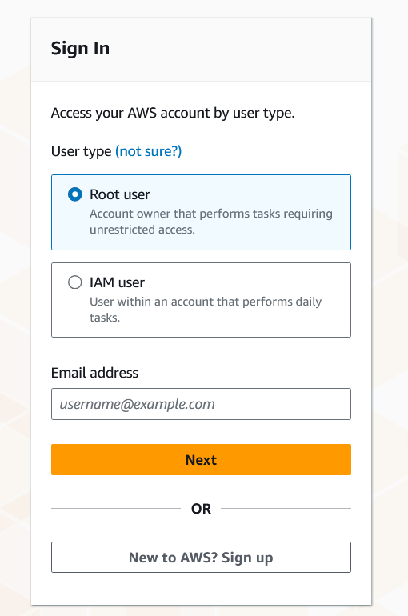
  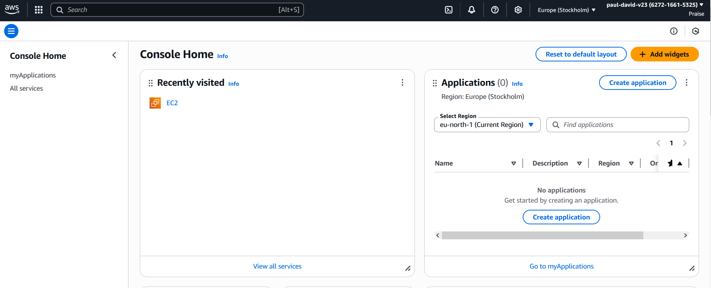
</p>


2. Open the EC2 Dashboard
- In the Services menu, search for and click EC2
- Click Launch Instance

<p float="left">
  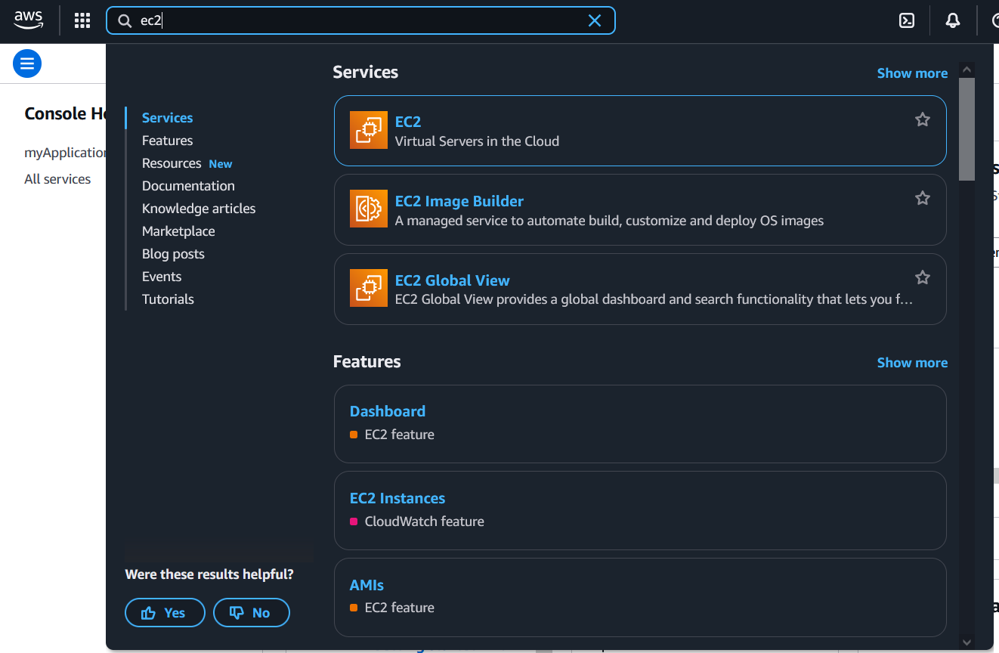
  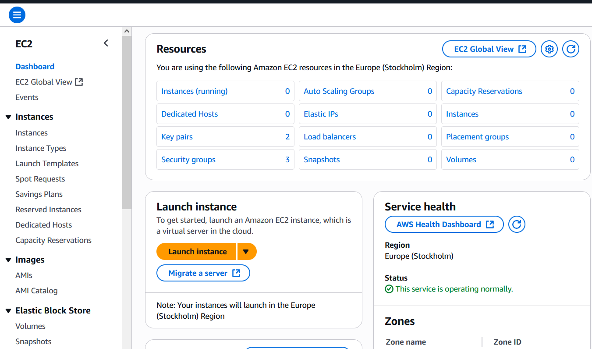
</p>


3. Configure Instance Basics
- Name your instance: e.g., lamp-server
- Amazon Machine Image (AMI):
- Choose  Ubuntu Server 22.04 LTS

Instance type:
-Select t3.micro (Free Tier eligible)

<p float="center">
  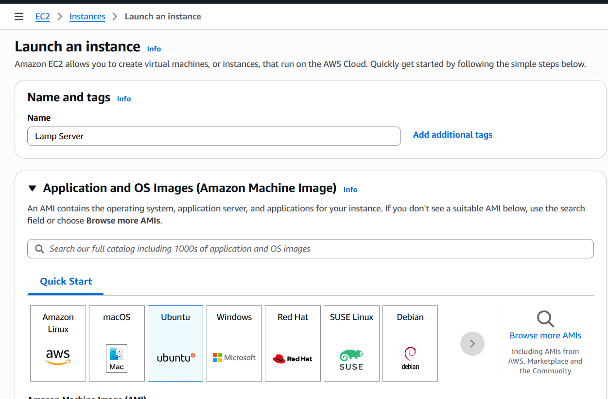
  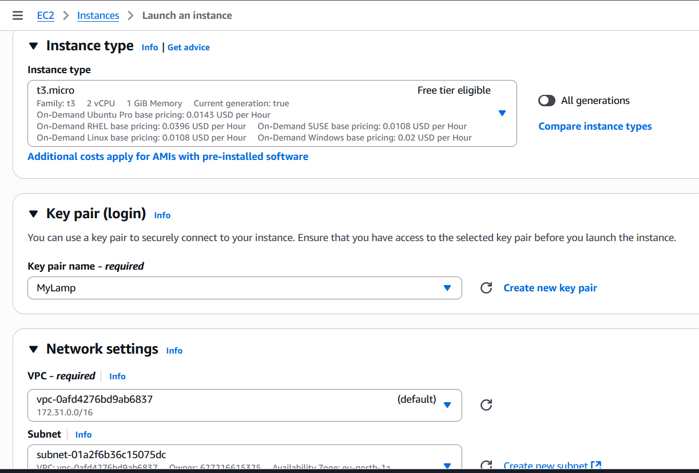
</p>


4. Create or Choose a Key Pair
- Under Key pair (login):
- Choose “Create new key pair” or select an existing one

If creating new:

- Name it (e.g., lamp-project)
- Choose .pem format (for Linux/macOS) or .ppk (for Windows PuTTY users)

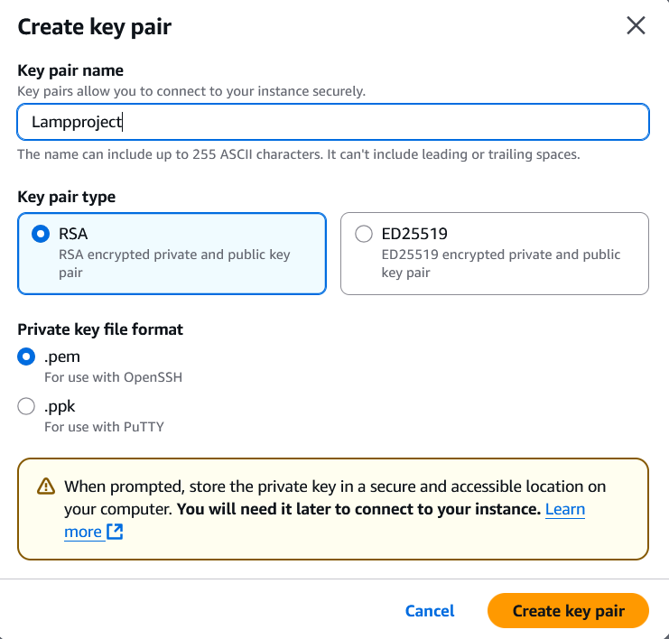

   **Download and save it securely – you’ll need it to connect**


5. Configure Network Settings
- VPC and Subnet: Leave as default (unless you’ve set up custom VPC)

   Firewall (Security group):
- Create a new security group with these inbound rules:
- SSH – TCP – port 22 – from My IP
- HTTP – TCP – port 80 – Anywhere (0.0.0.0/0)
- HTTPS – TCP – port 443 – Anywhere (optional)

<p float="center">
  
  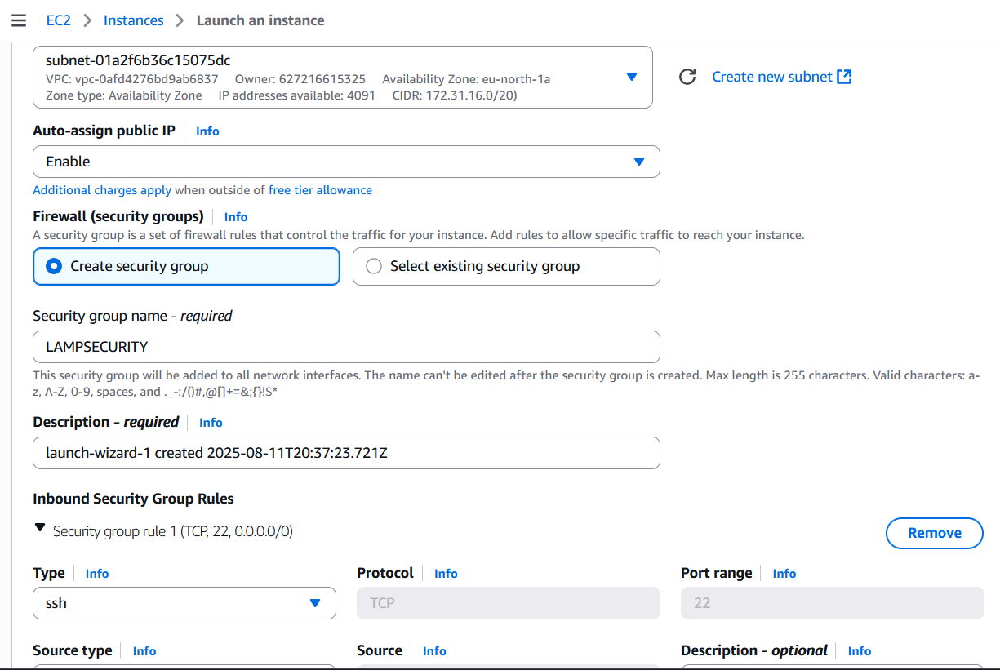
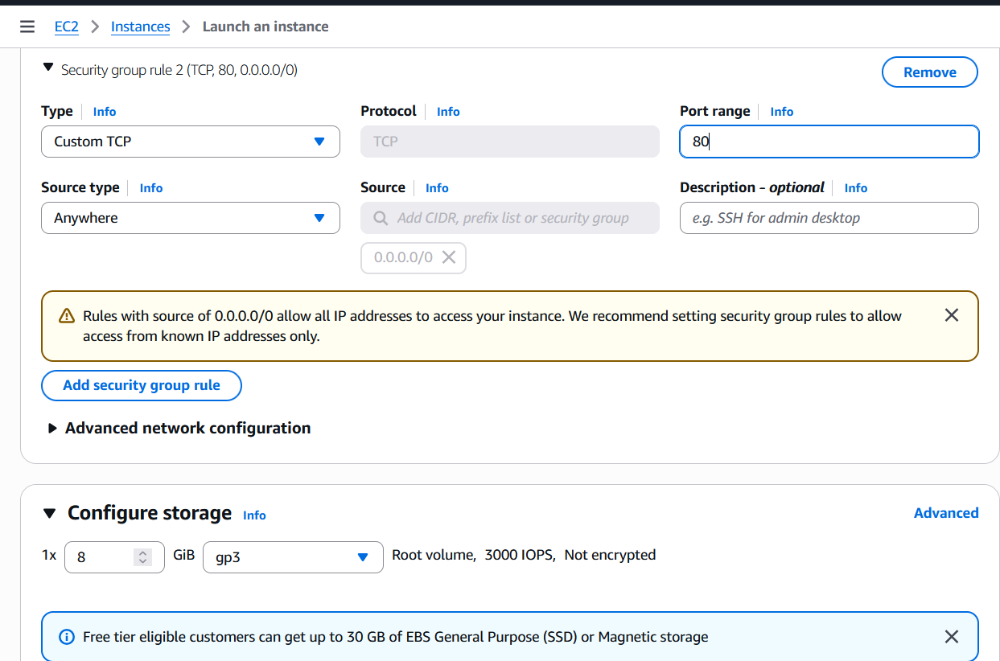
</p>


6. Storage Configuration
- Keep the default 8 GB (you can increase it if needed)


7. Review and Launch
- Double-check all configurations
- Click Launch Instance
- Wait a few seconds → you’ll see “Your instances are now launching”
<p float="center">
  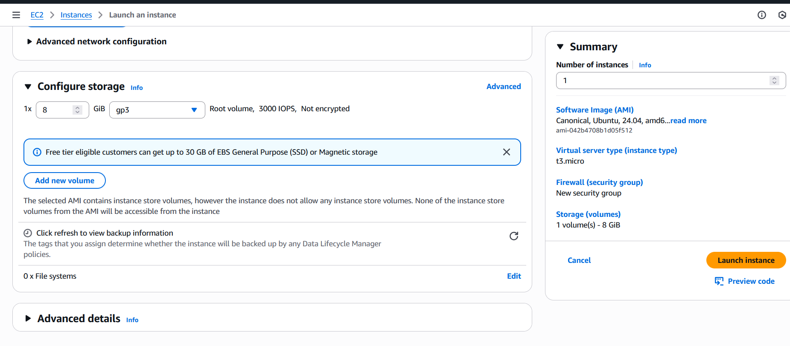
  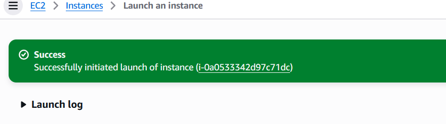
</p>


8. Access Your EC2 Instance
- Go to the Instances section
- Select your instance → click Connect
- Choose the SSH tab → follow the instructions provided using your downloaded .pem key

<p float="center">
  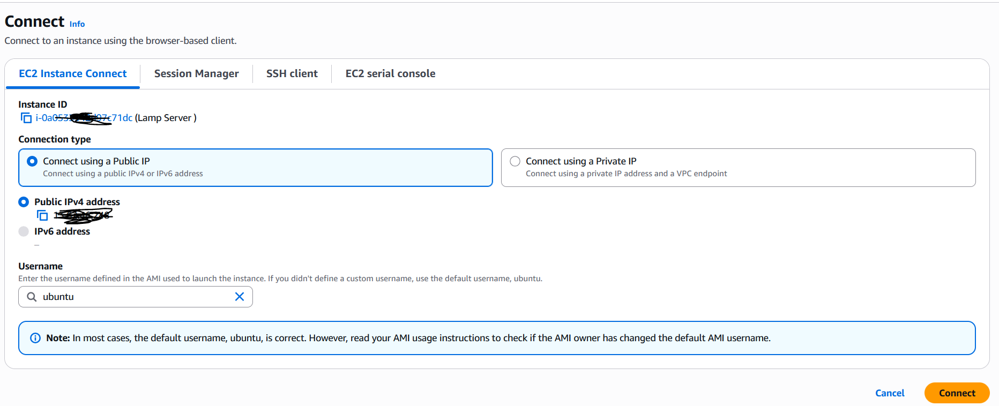
  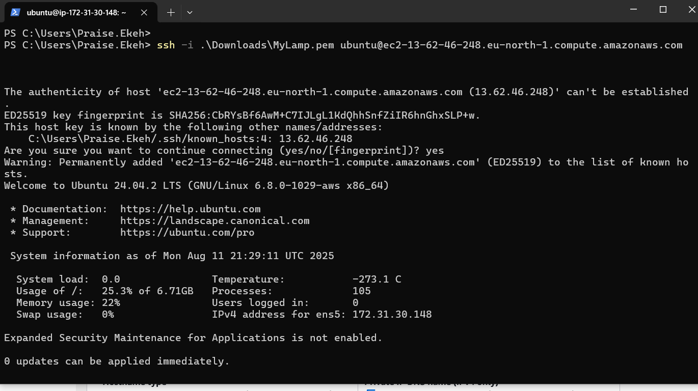
</p>


## INSTALLING APACHE AND UPDATING FIREWALL ##
### OVERVIEW ###

Apache HTTP Server (often called Apache) is one of the most widely used open-source web servers in the world. It is designed to serve web pages, process HTTP requests, and run websites or applications. Apache is known for its flexibility, stability, and support for multiple operating systems.

### Tasks Performed by Apache ###
 - Serve Web Content: Delivers web pages, images, and files to clients’ browsers.
 - Process Dynamic Requests: Works with languages like PHP, Python, or Perl to generate content on demand.
 - Manage Connections: Handles multiple simultaneous requests efficiently.
 - URL Redirection & Rewriting: Redirects users or modifies request URLs.
 - Authentication & Authorization: Controls access to resources.
 - Logging & Monitoring: Records access logs and error logs.
 - Load Balancing: Distributes traffic to multiple backend servers.
 - SSL/TLS Encryption: Secures communication between server and client.

### Install Apache using Ubuntu’s package manager 'apt': ###

```powershell
# update a list of packages in package manager
$ sudo apt update
# run apache2 package installation
$ sudo apt install apache2
```
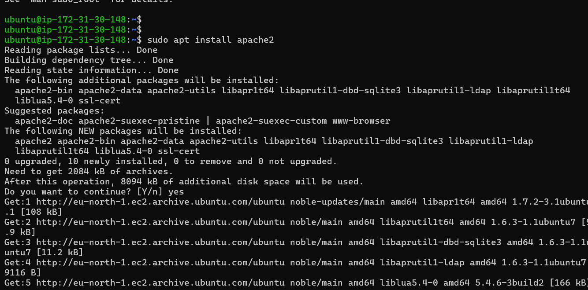

To verify that apache2 is running as a Service in OS

```powershell
# You can start, stop, and check the status of the Apache2 server with one of these commands:
$ sudo systemctl stop apache2
$ sudo systemctl start apache2
$ sudo systemctl status apache2
```
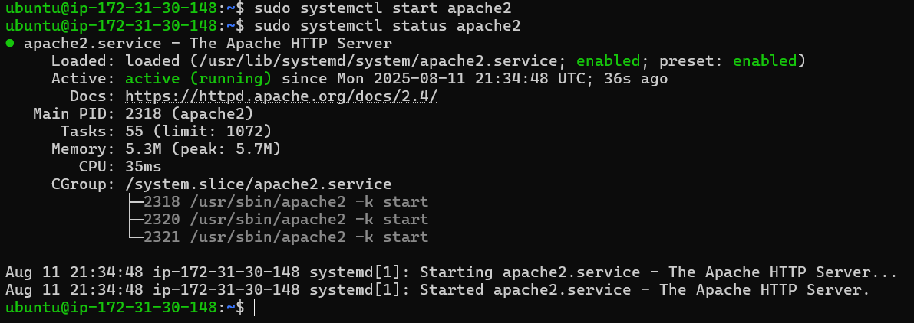

If it is green and running, then you did everything correctly - you have just launched your first Web Server in the Clouds!
Before we can receive any traffic by our Web Server, we need to open TCP port 80 which is the default port that web browsers use to access web pages on the Internet
As we know, we have TCP port 22 open by default on our EC2 machine to access it via SSH, so we need to add a rule to EC2 configuration to open inbound connection through port 80:

Test Apache in a Browser
 - Copy your EC2 Public IP from the AWS console.
 - Paste it in a browser:

```powershell
http://<Public-IP-Address>:80)
```
You should see the Apache default test page.

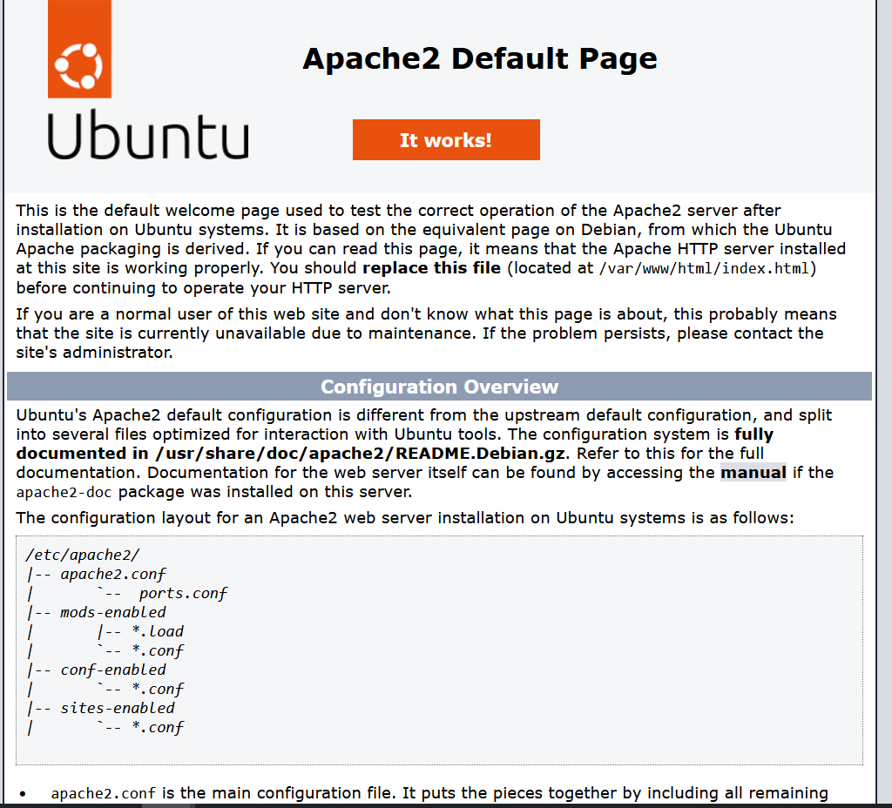

## INSTALLING MYSQL ##
### OVERVIEW ###
MySQL is a relational database used to store and query application data. On Ubuntu/Debian, you can install MySQL Server directly. On Amazon Linux, the default is MariaDB (a drop-in replacement for MySQL). Both work with common LAMP stacks.

Again, use 'apt' to acquire and install this software:

```powershell
$ sudo apt install mysql-server
```
When the installation is finished, log in to the MySQL console by typing:

```powershell
$ sudo mysql
```
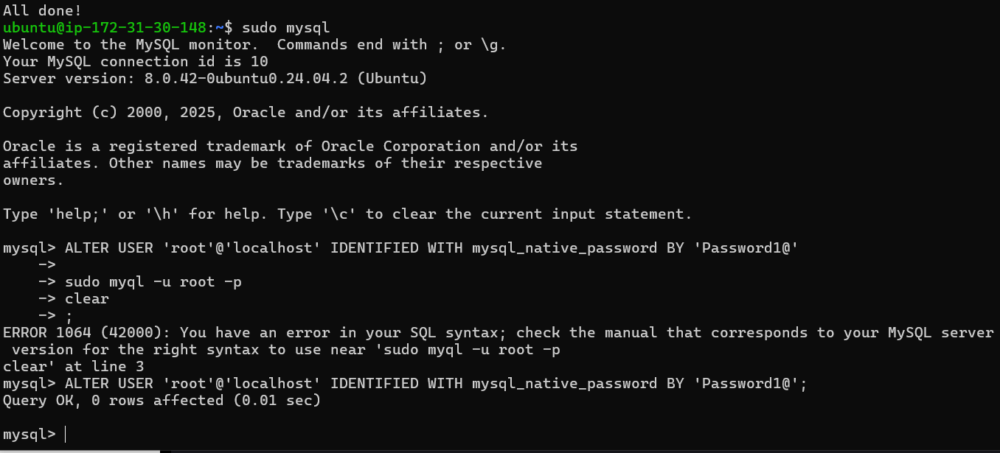

It’s recommended that you run a security script that comes pre-installed with MySQL. This script will remove some insecure default settings and lock down access to your database system. Before running the script you will set a password for the root user, using mysql_native_password as default authentication method. We’re defining this user’s password as PassWord.1.

```powershell
ALTERUSER'root'@'localhost' IDENTIFIED WITH mysql_native_password BY'PassWord.1';
```

Exit the MySQL 

```powershell
mysql > exit 
```

Start the interactive script by running:
```powershell
$ sudo mysql_secure_installation
```
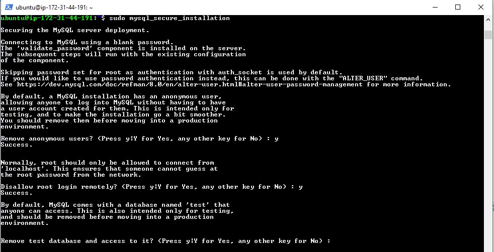

There are three levels of password validation policy:

LOW    Length >= 8
MEDIUM Length >= 8, numeric, mixed case, and special characters
STRONG Length >= 8, numeric, mixed case, special characters and dictionary file

Please enter 0 = LOW, 1 = MEDIUM and 2 = STRONG: 1

When you’re finished, test if you’re able to log in to the MySQL console by typing:

```powershell
$ sudo mysql -p
```
Notice the -p flag in this command, which will prompt you for the password used after changing the root user password.
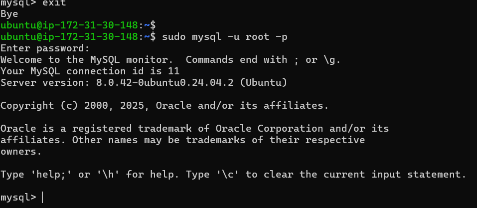

To exit the MySQL console, type:

```powershell
mysql> exit
```

The MySQL server has been successfully installed and secured. Next, we’ll proceed with installing PHP, the final component of the LAMP stack.

## INSTALLATION PHP ##
### OVERVIEW ###
PHP (Hypertext Preprocessor) is a popular server-side scripting language used to build dynamic and interactive web applications. When combined with Apache and MySQL, it forms the LAMP (Linux, Apache, MySQL/MariaDB, PHP) stack, powering many websites and CMS platforms like WordPress, Drupal, and Joomla.

To install these 3 packages at once, run:

```powershell
$ sudo apt install php libapache2-mod-php php-mysql
```
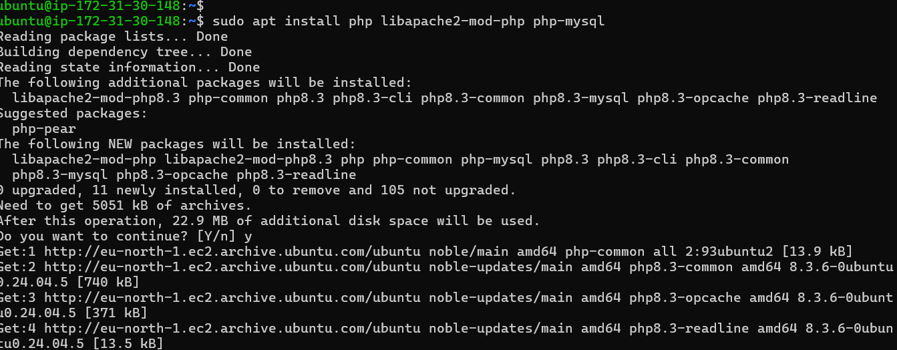
LAMP STACK IMPLEMENTATION IN AWS/Images/php.PNG
Once the installation is finished, you can run the following command to confirm your PHP version:

```powershell
php -v

PHP 8.3.6 (cli) (built: Apr 15 2024 19:21:47) (NTS)
Copyright (c) The PHP Group
Zend Engine v4.3.6, Copyright (c) Zend Technologies
with Zend OPcache v8.3.6, Copyright (c), by Zend Technologies
```
<p float="center">
  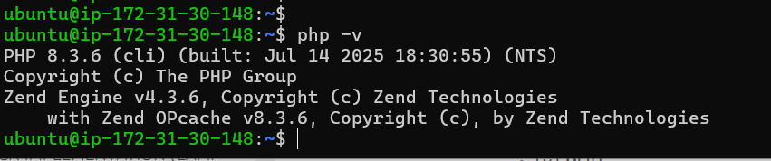
  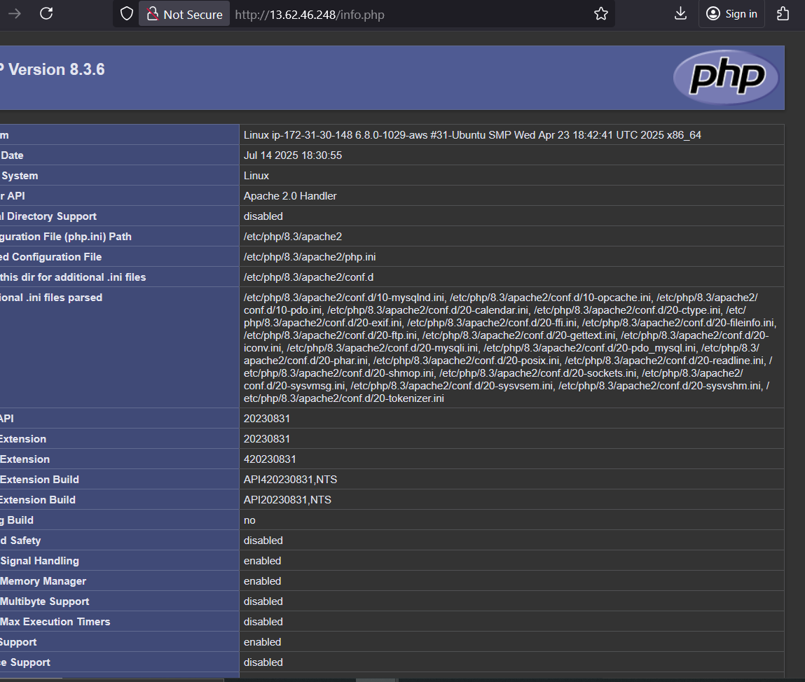
</p>

Your LAMP stack is now fully installed and ready to use

To verify your setup using a PHP script, it’s recommended to configure an Apache Virtual Host. This will provide a dedicated location for your website’s files and directories, and also enable you to host multiple websites on the same server seamlessly, without visitors noticing.

### CREATING A VIRTUAL HOST FOR YOUR WEBSITE USING APACHE ###

Create the directory for projectlamp using 'mkdir' command as follows:

```powershell
$ sudo mkdir /var/www/projectlamp
```
Assign ownership of the directory with the $USER environment variable, which will reference your current system user:

```powershell
$ sudo chown -R $USER:$USER /var/www/projectlamp
```
Create and open a new configuration file in Apache’s sites-available directory using your preferred command-line editor. Here, we’ll be using nano :

```powershell
$ sudo nano /etc/apache2/sites-available/projectlamp.conf
```
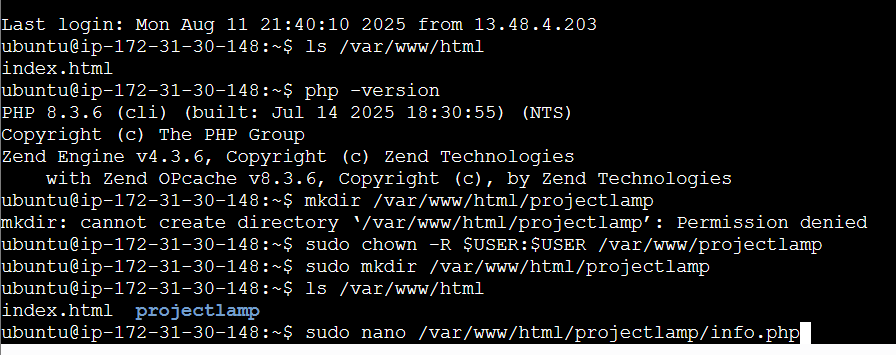

This will create a new blank file. Paste in the following bare-bones configuration by hitting on i on the keyboard to enter the insert mode, and paste the text:

```powershell
<VirtualHost *:80>
    ServerName projectlamp
    ServerAlias www.projectlamp 
    ServerAdmin webmaster@localhost
    DocumentRoot /var/www/projectlamp
    ErrorLog ${APACHE_LOG_DIR}/error.log
    CustomLog ${APACHE_LOG_DIR}/access.log combined
</VirtualHost>
```

You can use the ls command to show the new file in the sites-available directory

```powershell
$ sudo ls /etc/apache2/sites-available
```
You will see something like this
```powershell
000-default.conf  default-ssl.conf  projectlamp.conf

```
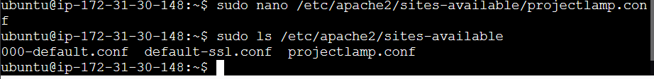

With this VirtualHost configuration, we’re telling Apache to serve projectlamp using /var/www/projectlampl as its web root directory. 

You can now use a2ensite command to enable the new virtual host:

```powershell
$ sudo a2ensite projectlamp
```
You might want to disable the default website that comes installed with Apache.

```powershell
$ sudo a2dissite 000-default
```
To make sure your configuration file doesn’t contain syntax errors, run:

```powershell
$ sudo apache2ctl configtest
```
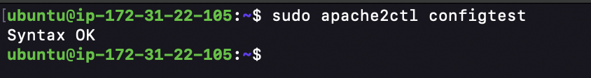

Finally, reload Apache so these changes take effect:

```powershell
$ sudo systemctl reload apache2
```

Your new website is now active, but the web root /var/www/projectlamp is still empty. Create an index.html file in that location so that we can test that the virtual host works as expected:

```powershell
sudo echo 'Hello LAMP from hostname' $(TOKEN=`curl -X PUT "http://169.254.169.254/latest/api/token" -H "X-aws-ec2-metadata-token-ttl-seconds: 21600"` && curl -H "X-aws-ec2-metadata-token: $TOKEN" -s http://169.254.169.254/latest/meta-data/public-hostname) 'with public IP' $(TOKEN=`curl -X PUT "http://169.254.169.254/latest/api/token" -H "X-aws-ec2-metadata-token-ttl-seconds: 21600"` && curl -H "X-aws-ec2-metadata-token: $TOKEN" -s http://169.254.169.254/latest/meta-data/public-ipv4) > /var/www/projectlamp/index.html

```

Now go to your browser and try to open your website URL using IP address:

```powershell
http://<Public-IP-Address>:80
```
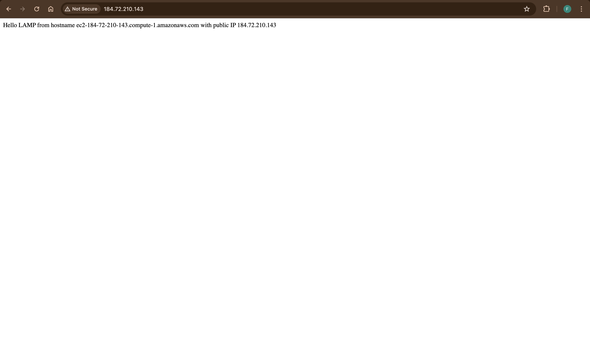

### Conclusion ###

By following these steps, you have successfully deployed a complete LAMP stack on your AWS EC2 instance. Starting from launching the instance, installing and configuring Apache, MySQL, and PHP, to setting up a Virtual Host, your server is now ready to host and serve dynamic web applications. With this foundation in place, you can now upload your own projects, configure domains, and further secure and optimize your environment for production use. This setup not only provides flexibility and scalability but also forms a reliable base for learning, development, and real-world deployment.


