## LEMP STACK IMPLEMENTATION ##
### OVERVIEW ###
The LEMP stack is a popular open-source web hosting environment that uses Linux, Nginx, MySQL, and PHP. It is widely deployed for hosting dynamic websites and applications due to its lightweight web server (Nginx) and reliable database system (MySQL/MariaDB).
In this implementation, we deploy a LEMP stack on an AWS EC2 instance (Ubuntu Server) and configure it to serve a PHP web page connected to a database

### LAUNCH EC2 INSTANCE ###
 - Log in to AWS Management Console.
 - Navigate to EC2 → Launch Instance.
 - Choose Ubuntu Server 22.04 LTS (HVM), SSD Volume Type.
 - Select an instance type (e.g., t2.micro – Free Tier Eligible).
 - Configure security group:
      - Allow SSH (22) from your IP.
      - Allow HTTP (80) from anywhere.
      - Allow HTTPS (443) if needed.
 - Launch instance and connect via SSH:

<p float="left">
  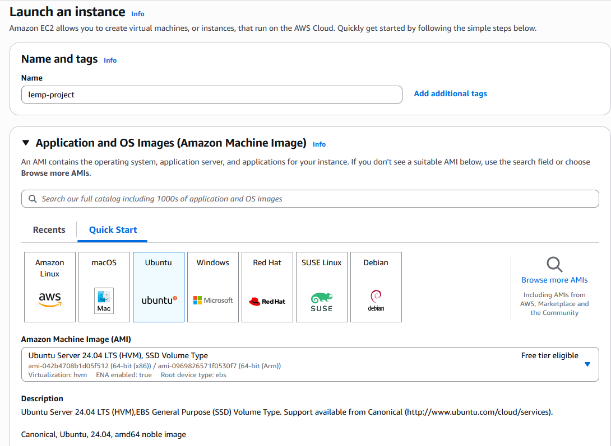
  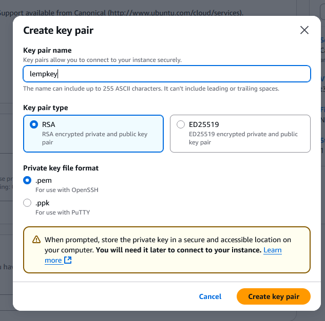
  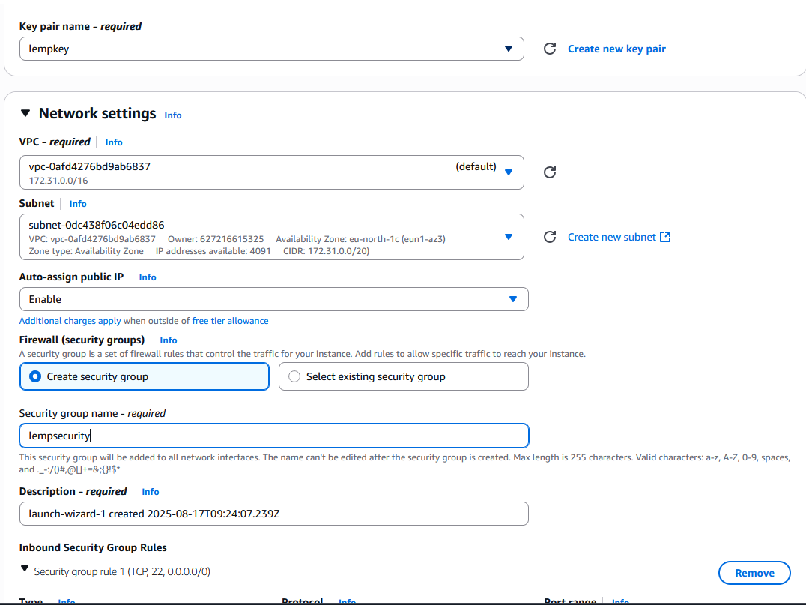
  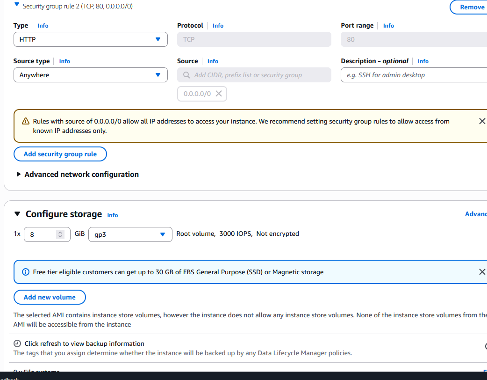
  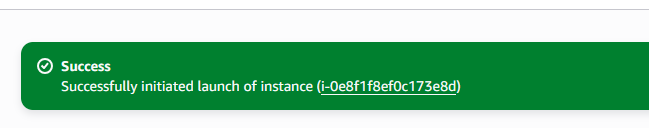
  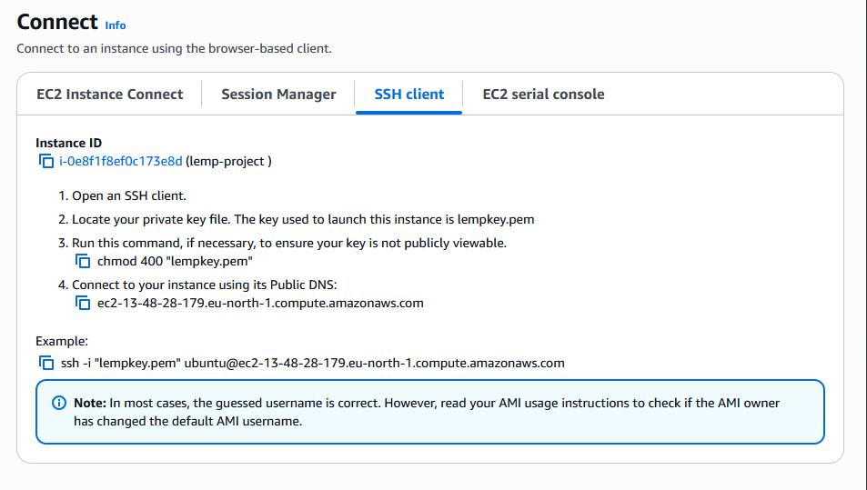
</p>

We will be using Git Bash to launch the EC2 instance 

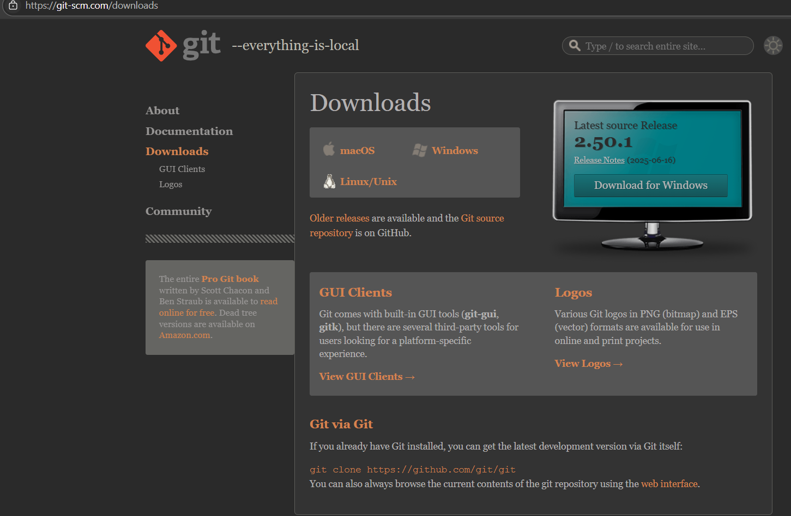

Here is the video on how to install [Gitbash](https://youtu.be/qdwWe9COT9k?si=3UIu-LD7gGLj2qiw).

```bash
$ cd downloads
```

```bash
choown 400 lempkey.pem
ssh -i lempkey.pem ubuntu@13.48.28.179
```

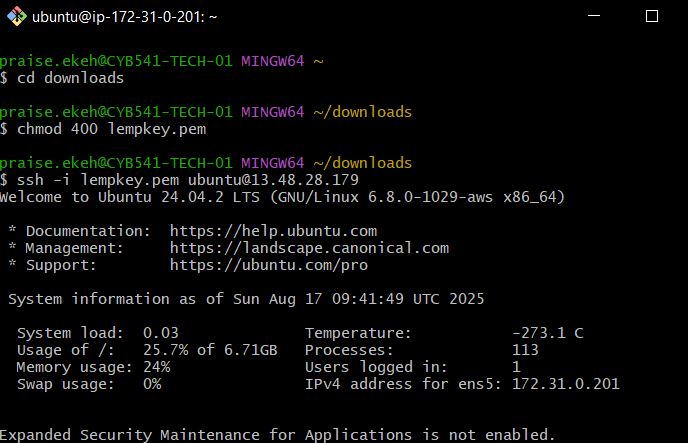

### INSTALLING THE NGINX WEB SERVER ###

Nginx is a web server used in the LEMP Project

We start by updating the server and then installing Nginx

```bash
sudo apt update
sudo apt install nginx
```

To verify that nginx was successfully installed and is running as a service in Ubuntu, run

```bash
sudo systemctl status nginx
```
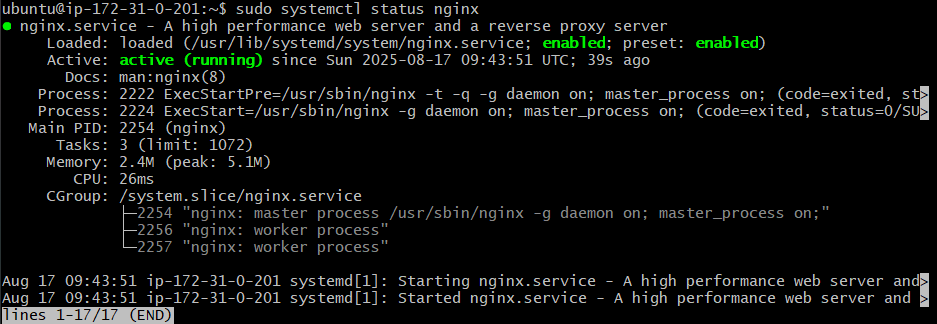

Our server is running, and we can access it locally and from the internet 

```bash
curl http://localhost:80 
or
curl http://127.0.0.1:80
```
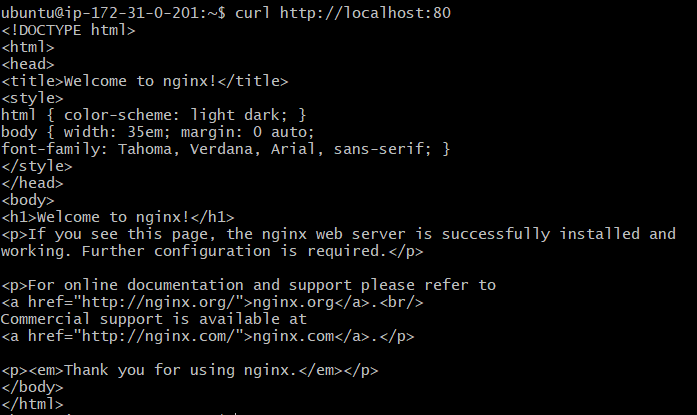

On a web browser

```web
http://<Public-Ip-address>:80
```
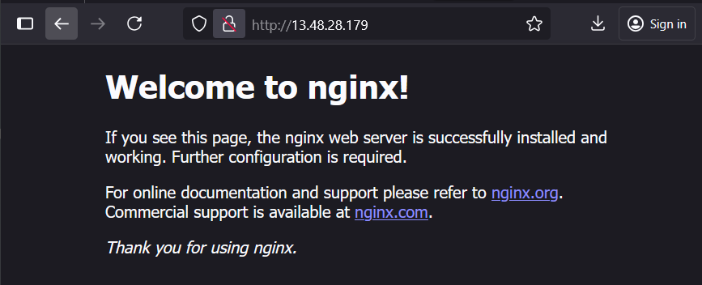


### INSTALLING MYSQL ###
Use 'apt' to acquire and install this software:

```bash
sudo apt install mysql-server
```

When prompted, confirm installation by typing 'Y' and then ENTER

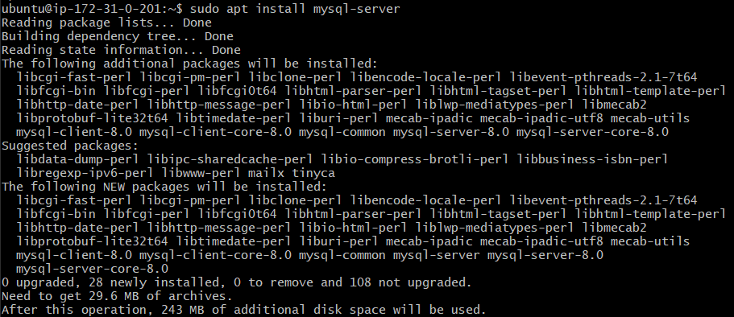

When the installation is finished, log in to the MySQL console by typing:


``` bash
sudo mysql
```
Set a password for the root user:

``` sql
ALTERUSER'root'@'localhost' IDENTIFIED WITH mysql_native_password BY'PassWord.1';
```


Exit the MySQL shell:

``` sql
mysql > exit
```

Validate password plugin:

``` bash
sudo mysql_secure_installation
```
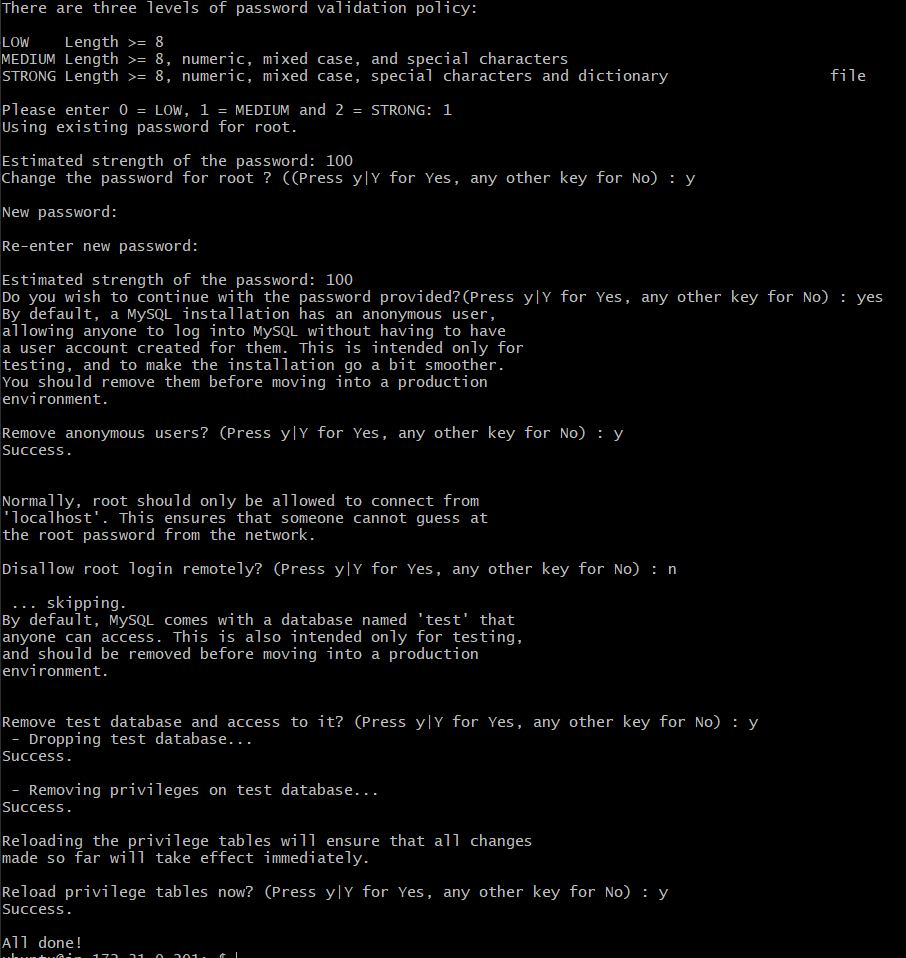

Testing if able to log in:

``` bash
sudo mysql -p
```
-P flag - prompt for password used after a change in the root user password 

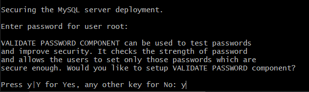

### INSTALLING PHP ###

To install these 2 packages at once,

``` bash
sudo apt install php-fpm php-mysql
```
LEMP STACK IMPLEMENTATION/IMAGES/phpinstall.PNG

When prompted, type Y and press Enter to confirm installation

### Configuring Nginx to use PHP Processor ###

Create the root web directory for your_doamin as follows:

``` bash
sudo mkdir /var/www/projectLAMP
```

Assign ownership of the directory

``` bash
$ sudo chown -R $USER:$USER /var/www/projectLEMP
```

Create a new configuration file in Nginx's

``` bash
$ sudo nano /etc/nginx/sites-available/projectLEMP
```
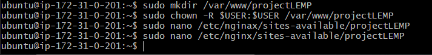


Create a new blank file 

``` nano
server {
    listen 80;
    server_name projectLEMP www.projectLEMP;
    root /var/www/projectLEMP;

    index index.html index.php;

    location / {
        try_files $uri $uri/ =404;
    }

    location ~ \.php$ {
        include snippets/fastcgi-php.conf;
        fastcgi_pass unix:/var/run/php/php8.3-fpm.sock;
    }

    location ~ /\.ht {
        deny all;
    }
}
```


Here’s what each of these directives and location blocks do:

 - listen — Defines what port Nginx will listen on. In this case, it will listen on port 80, the default port for HTTP.

 - root — Defines the document root where the files served by this website are stored.

 - index — Defines in which order Nginx will prioritize index files for this website. It is a common practice to list index.html files with a higher precedence than index.php files to allow for quickly setting up a maintenance landing page in PHP applications. You can adjust these settings to better suit your application needs.

 - server_name — Defines which domain names and/or IP addresses this server block should respond for. Point this directive to your server’s domain name or public IP address.

 - location / — The first location block includes a try_files directive, which checks for the existence of files or directories matching a URI request. If Nginx cannot find the appropriate resource, it will return a 404 error.

 - location ~ \.php$ — This location block handles the actual PHP processing by pointing Nginx to the fastcgi-php.conf configuration file and the php7.4-fpm.sock file, which declares what socket is associated with php-fpm.

 - location ~ /\.ht — The last location block deals with .htaccess files, which Nginx does not process. By adding the deny all directive, if any .htaccess files happen to find their way into the document root ,they will not be served to visitors.

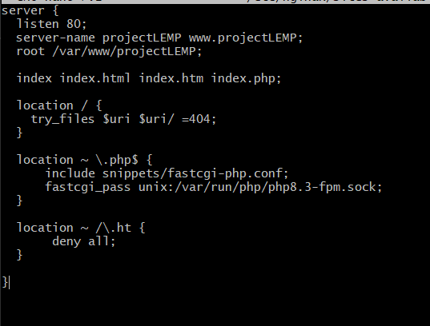

Enable the configuration

``` ubuntu
$ sudo ln -s /etc/nginx/sites-available/projectLEMP /etc/nginx/sites-enabled/
```
This will instruct Nginx to use the specified configuration the next time it is reloaded.

Testing the configuration for syntax errors

``` ubuntu
$ sudo nginx -t
```
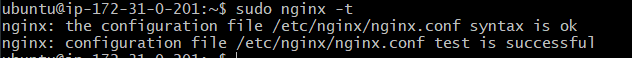

Disable default Nginx host that is currently configured listen on port 80

``` ubuntu
$ sudo unlink /etc/nginx.sites-enabled/default
$ sudo systemctl reload nginx # Reload the nginx 
```
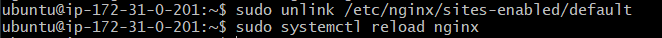

Our website is now active! We then create an index.html file in the location so that we can test that our new server block works as expected:

``` ubuntu
sudo echo 'Hello LEMP from hostname' $(TOKEN=`curl -X PUT "http://169.254.169.254/latest/api/token" -H "X-aws-ec2-metadata-token-ttl-seconds: 21600"` && curl -H "X-aws-ec2-metadata-token: $TOKEN" -s http://169.254.169.254/latest/meta-data/public-hostname) 'with public IP' $(TOKEN=`curl -X PUT "http://169.254.169.254/latest/api/token" -H "X-aws-ec2-metadata-token-ttl-seconds: 21600"` && curl -H "X-aws-ec2-metadata-token: $TOKEN" -s http://169.254.169.254/latest/meta-data/public-ipv4) > /var/www/projectLEMP/index.html
```
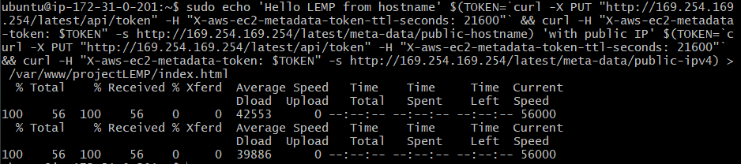

Web browser 

``` ubuntu
(http://13.48.28.179:80)
```
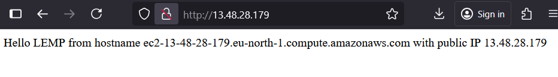

If you see the text from the 'echo' command you wrote to index.html file, then it means your Nginx site is working as expected. 

### TESTING PHP WITH NGINX ###

You can do this by creating a test PHP file in your document root. Open a new file called info.php within your document root in your text editor:

``` ubuntu
$ nano /var/www/projectLEMP/info.php
```
``` ubuntu
<?php
phpinfo();
```
Access your browser 

``` ubuntu
http://13.48.3.99/info.php
``` 
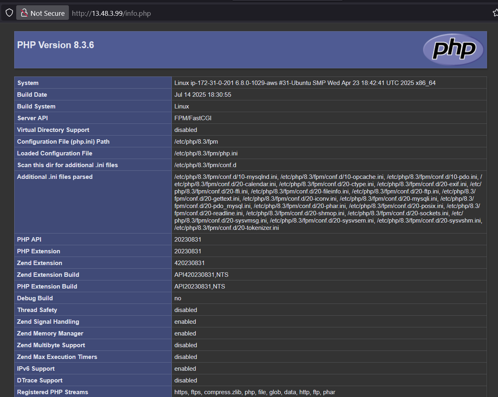

It’s best to remove the file you created, as it contains sensitive information about your PHP environment and your Ubuntu server. You can use rm to remove that file:

``` ubuntu
$ sudo rm /var/www/projectLEMP/info.php
``` 

### RETRIEVING DATA FROM MYSQL DATABASE WITH PHP ###

Connect to the MySQL console using the root account

``` ubuntu
$ sudo mysql -p
``` 
To create a new database
``` ubuntu
mysql> CREATE DATABASE `example_database`;
``` 

The following command creates a new user named example_user, using mysql_native_password as the default authentication method. We’re defining this user’s password as PassWord.123, but you can replace this value with a secure password of your own choosing.

``` ubuntu
mysql>  CREATE USER 'example_user'@'%' IDENTIFIED WITH mysql_native_password BY 'PassWord.123';
``` 

 User permission over the example_database database

``` ubuntu
mysql> GRANT ALL ON example_database.* TO 'example_user'@'%';
``` 
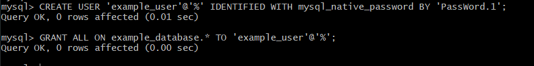

Confirm that you have access to the example_database database
``` ubuntu
mysql> SHOW DATABASES;
``` 
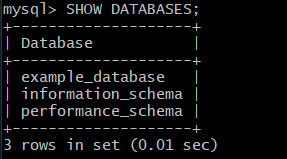

Create a test table named todo-list

``` ubuntu
CREATE TABLE example_database.todo_list (
mysql>     item_id INT AUTO_INCREMENT,
mysql>     content VARCHAR(255),
mysql>     PRIMARY KEY(item_id)
mysql> );
```
You could insert a few rows of content in the test table
``` sql
mysql> INSERT INTO example_db.todo_list (content) VALUES ("My first important item");
mysql> INSERT INTO example_db.todo_list (content) VALUES ("My second important item");
mysql> INSERT INTO example_db.todo_list (content) VALUES ("My third important item");
mysql> INSERT INTO example_db.todo_list (content) VALUES ("My fourth important item");
``` 

Confirm that the data was successfully saved

``` sql
mysql>  SELECT * FROM example_database.todo_list;
```

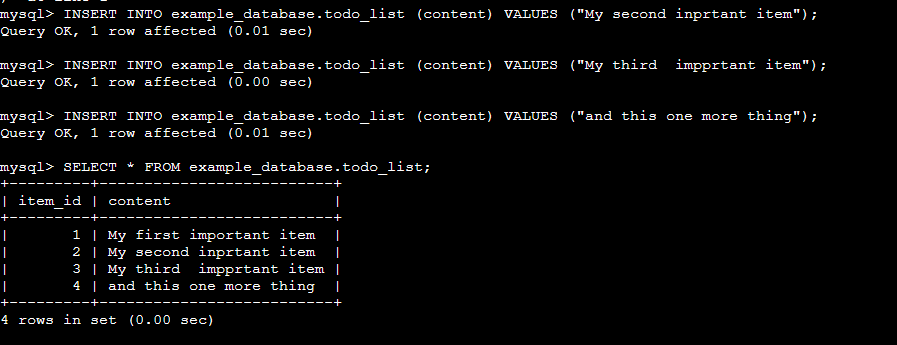

Exit from the MySQL console

Now you can create a PHP script that will connect to MySQL and query for your content.

``` ubuntu
$ nano /var/www/projectLEMP/todo_list.php
```
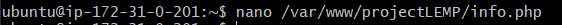

Copy this script into the todo_list.php

``` nano
<?php
$user = "example_user";
$password = "passWord.123";
$database = "example_db";
$table = "todo_list";

try {
    $db = new PDO("mysql:host=localhost;dbname=$database", $user, $password);
    echo "<h2>TODO</h2><ol>";
    foreach($db->query("SELECT content FROM $table") as $row) {
        echo "<li>" . $row['content'] . "</li>";
    }
    echo "</ol>";
} catch (PDOException $e) {
    print "Error!: " . $e->getMessage() . "<br/>";
    die();
}
```
Save and close 

You can now access this page in your web browser by visiting the public IP address configured for your website, followed by /todo_list.php

``` web
http://13.48.3.99/todo_list.php
```
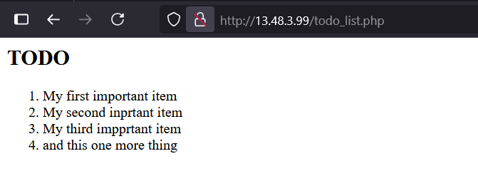

This means php environment is ready to connect and interact with the MySQL server.
