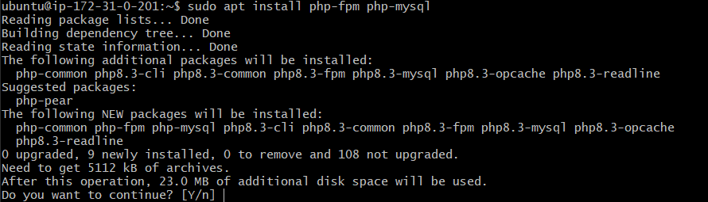

## LEMP STACK IMPLEMENTATION ##
### OVERVIEW ###
Overview
The **LEMP stack** is a popular open-source web hosting environment that consists of:

- Linux – the operating system
- Nginx – a high-performance web server
- MySQL – a relational database management system
- PHP – the server-side scripting language

This combination is widely used to host dynamic websites and applications because of its lightweight web server (Nginx) and reliable database system (MySQL).

In this project, we will:

-  Deploy a LEMP stack on an AWS EC2 instance (Ubuntu Server)

-  Configure Nginx to serve a PHP web page

-  Connect PHP to a MySQL database


### STEP 1: LAUNCH AN EC2 INSTANCE ###
 - Log in to the AWS Management Console.
 - Navigate to EC2 → Launch Instance.
 - Choose Ubuntu Server 22.04 LTS (HVM), SSD Volume Type.
 - Select an instance type (e.g., t2.micro – Free Tier Eligible).
 - Configure security group:
      - Allow SSH (22) from your IP.
      - Allow HTTP (80) from anywhere.
      - Allow HTTPS (443) if needed.
 - Launch instance and connect via SSH:

<p float="left">
  
  
  
  
  
  
</p>

We’ll use Git Bash to launch the EC2 instance.


Here is the video on how to install [Gitbash](https://youtu.be/qdwWe9COT9k?si=3UIu-LD7gGLj2qiw).

```bash
$ cd downloads
choown 400 lempkey.pem
ssh -i lempkey.pem ubuntu@13.48.28.179
```


You are now inside your Ubuntu server.

### STEP 2: INSTALLING THE NGINX WEB SERVER ###

Update and install

```bash
sudo apt update
sudo apt install nginx
```
Check service status:

```bash
sudo systemctl status nginx
```


Verify installation:

```bash
curl http://localhost:80 
or
curl http://127.0.0.1:80
```


Or from your browser:

```web
http://<Public-Ip-address>:80
```


### STEP 3: INSTALLING MYSQL ###
Install MySQL server:

```bash
sudo apt install mysql-server
```
When prompted, confirm installation by typing 'Y' and then ENTER


Log in to MySQL:

``` bash
sudo mysql
```
Set a password for the root user:

``` sql
ALTERUSER'root'@'localhost' IDENTIFIED WITH mysql_native_password BY'PassWord.1';
```


Exit the MySQL shell:

``` sql
mysql > exit
```

Secure installation:

``` bash
sudo mysql_secure_installation
```


Login with password:

``` bash
sudo mysql -p
```
-P flag - prompt for password used after a change in the root user password 


### STEP 4: INSTALLING PHP ###

Install PHP and MySQL extension:

``` bash
sudo apt install php-fpm php-mysql
```



When prompted, type Y and press Enter to confirm installation

### STEP 5:Configuring Nginx to use PHP Processor ###

Create a project directory:

``` bash
sudo mkdir /var/www/projectLAMP
$ sudo chown -R $USER:$USER /var/www/projectLEMP
```

Create a new configuration file in Nginx’s sites-available directory:

``` bash
$ sudo nano /etc/nginx/sites-available/projectLEMP
```


Paste the configuration to define the server block:

``` nano
server {
    listen 80;
    server_name projectLEMP www.projectLEMP;
    root /var/www/projectLEMP;

    index index.html index.php;

    location / {
        try_files $uri $uri/ =404;
    }

    location ~ \.php$ {
        include snippets/fastcgi-php.conf;
        fastcgi_pass unix:/var/run/php/php8.3-fpm.sock;
    }

    location ~ /\.ht {
        deny all;
    }
}
```


Here’s what each of these directives and location blocks does:

 - listen — Defines what port Nginx will listen on. In this case, it will listen on port 80, the default port for HTTP.

 - root — Defines the document root where the files served by this website are stored.

 - index — Defines in which order Nginx will prioritize index files for this website. It is a common practice to list index.html files with a higher precedence than index.php files to allow for quickly setting up a maintenance landing page in PHP applications. You can adjust these settings to better suit your application needs.

 - server_name — Defines which domain names and/or IP addresses this server block should respond for. Point this directive to your server’s domain name or public IP address.

 - location / — The first location block includes a try_files directive, which checks for the existence of files or directories matching a URI request. If Nginx cannot find the appropriate resource, it will return a 404 error.

 - location ~ \.php$ — This location block handles the actual PHP processing by pointing Nginx to the fastcgi-php.conf configuration file and the php7.4-fpm.sock file, which declares what socket is associated with php-fpm.

 - location ~ /\.ht — The last location block deals with .htaccess files, which Nginx does not process. By adding the deny all directive, if any .htaccess files happen to find their way into the document root ,they will not be served to visitors.


Enable the Nginx configuration and test it to ensure everything works:

``` ubuntu
$ sudo ln -s /etc/nginx/sites-available/projectLEMP /etc/nginx/sites-enabled/
```
 “This tells Nginx to apply the new configuration on the next reload.”

Test the Nginx configuration for syntax errors:

``` ubuntu
$ sudo nginx -t
```


Disable the default Nginx host that listens on port 80:

``` ubuntu
$ sudo unlink /etc/nginx.sites-enabled/default
$ sudo systemctl reload nginx # Reload the nginx 
```


Create an index.html file:

``` ubuntu
sudo echo 'Hello LEMP from hostname' $(TOKEN=`curl -X PUT "http://169.254.169.254/latest/api/token" -H "X-aws-ec2-metadata-token-ttl-seconds: 21600"` && curl -H "X-aws-ec2-metadata-token: $TOKEN" -s http://169.254.169.254/latest/meta-data/public-hostname) 'with public IP' $(TOKEN=`curl -X PUT "http://169.254.169.254/latest/api/token" -H "X-aws-ec2-metadata-token-ttl-seconds: 21600"` && curl -H "X-aws-ec2-metadata-token: $TOKEN" -s http://169.254.169.254/latest/meta-data/public-ipv4) > /var/www/projectLEMP/index.html
```


On web browser:

``` ubuntu
(http://13.48.28.179:80)
```


If the text you added with the `echo` command appears in the browser, your Nginx site is working correctly.

### STEP 6: TESTING PHP WITH NGINX ###

Create PHP info file:

``` ubuntu
$ nano /var/www/projectLEMP/info.php
```
Add:
``` ubuntu
<?php
phpinfo();
```
Access your browser 

``` ubuntu
http://13.48.3.99/info.php
``` 


Delete after testing(contains sensitive info):

``` ubuntu
$ sudo rm /var/www/projectLEMP/info.php
```
It’s best Delete the file to protect sensitive PHP and server details. Use the `rm` command to remove it.

### STEP 7: CONNECT PHP TO MYSQL ###

Login to MySQL console:

``` bash
$ sudo mysql -p
``` 
Create a database & user:

``` sql
mysql> CREATE DATABASE example_database;
mysql> CREATE USER 'example_user'@'%' IDENTIFIED WITH mysql_native_password BY 'PassWord.123';
mysql> GRANT ALL ON example_database.* TO 'example_user'@'%';
``` 

This command creates a new user example_user with the mysql_native_password method and sets the password (replace PassWord.123 with your own secure password).


Show created database:
``` sql
mysql> SHOW DATABASES;
``` 


Create Table:

``` sql
CREATE TABLE example_database.todo_list (
mysql>     item_id INT AUTO_INCREMENT,
mysql>     content VARCHAR(255),
mysql>     PRIMARY KEY(item_id)
mysql> );
```

Create Contents:

``` sql
mysql> INSERT INTO example_db.todo_list (content) VALUES ("My first important item");
mysql> INSERT INTO example_db.todo_list (content) VALUES ("My second important item");
mysql> INSERT INTO example_db.todo_list (content) VALUES ("My third important item");
mysql> INSERT INTO example_db.todo_list (content) VALUES ("My fourth important item");
``` 

Confirm the data was saved:

``` sql
mysql>  SELECT * FROM example_database.todo_list;
```


Exit from MySQL:

``` sql
mysql>  Exit;
```

Create a PHP script that establishes a connection to MySQL database:

``` ubuntu
$ nano /var/www/projectLEMP/todo_list.php
```


Paste the following script into a file named todo_list.php:

``` nano
<?php
$user = "example_user";
$password = "passWord.123";
$database = "example_db";
$table = "todo_list";

try {
    $db = new PDO("mysql:host=localhost;dbname=$database", $user, $password);
    echo "<h2>TODO</h2><ol>";
    foreach($db->query("SELECT content FROM $table") as $row) {
        echo "<li>" . $row['content'] . "</li>";
    }
    echo "</ol>";
} catch (PDOException $e) {
    print "Error!: " . $e->getMessage() . "<br/>";
    die();
}
```

Save and Close.

Open your web browser and enter your server’s public IP address, then add /todo_list.php at the end of the URL to access the page

Access web browser:
``` web
http://13.48.3.99/todo_list.php
```


Congratulations! You have successfully deployed a LEMP stack on AWS EC2.
